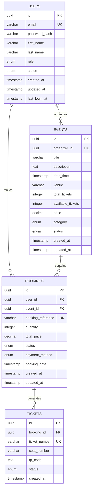

# 🗄️ Database Schema

## Overview
PostgreSQL database schema for the Event Ticketing Platform with normalized relationships and indexing strategy.

## Entity Relationship Diagram



## Table Definitions

### users
User accounts and authentication information.

```sql
CREATE TABLE users (
    id UUID PRIMARY KEY DEFAULT gen_random_uuid(),
    email VARCHAR(255) UNIQUE NOT NULL,
    password_hash VARCHAR(255) NOT NULL,
    first_name VARCHAR(100) NOT NULL,
    last_name VARCHAR(100) NOT NULL,
    role VARCHAR(20) NOT NULL DEFAULT 'USER' CHECK (role IN ('USER', 'ADMIN')),
    status VARCHAR(20) NOT NULL DEFAULT 'ACTIVE' CHECK (status IN ('ACTIVE', 'SUSPENDED', 'BANNED')),
    created_at TIMESTAMP WITH TIME ZONE DEFAULT CURRENT_TIMESTAMP,
    updated_at TIMESTAMP WITH TIME ZONE DEFAULT CURRENT_TIMESTAMP,
    last_login_at TIMESTAMP WITH TIME ZONE
);

-- Indexes
CREATE INDEX idx_users_email ON users(email);
CREATE INDEX idx_users_role ON users(role);
CREATE INDEX idx_users_status ON users(status);
CREATE INDEX idx_users_created_at ON users(created_at);
```

### events
Event information and ticket management.

```sql
CREATE TABLE events (
    id UUID PRIMARY KEY DEFAULT gen_random_uuid(),
    organizer_id UUID NOT NULL REFERENCES users(id) ON DELETE CASCADE,
    title VARCHAR(255) NOT NULL,
    description TEXT,
    date_time TIMESTAMP WITH TIME ZONE NOT NULL,
    venue VARCHAR(255) NOT NULL,
    total_tickets INTEGER NOT NULL CHECK (total_tickets > 0),
    available_tickets INTEGER NOT NULL CHECK (available_tickets >= 0),
    price DECIMAL(10,2) NOT NULL CHECK (price >= 0),
    category VARCHAR(50) NOT NULL CHECK (category IN ('MUSIC', 'SPORTS', 'THEATER', 'CONFERENCE', 'WORKSHOP', 'OTHER')),
    status VARCHAR(20) NOT NULL DEFAULT 'ACTIVE' CHECK (status IN ('ACTIVE', 'CANCELLED', 'COMPLETED')),
    created_at TIMESTAMP WITH TIME ZONE DEFAULT CURRENT_TIMESTAMP,
    updated_at TIMESTAMP WITH TIME ZONE DEFAULT CURRENT_TIMESTAMP,
    
    CONSTRAINT check_available_tickets CHECK (available_tickets <= total_tickets)
);

-- Indexes
CREATE INDEX idx_events_organizer_id ON events(organizer_id);
CREATE INDEX idx_events_status ON events(status);
CREATE INDEX idx_events_category ON events(category);
CREATE INDEX idx_events_date_time ON events(date_time);
CREATE INDEX idx_events_created_at ON events(created_at);
CREATE INDEX idx_events_title_search ON events USING gin(to_tsvector('english', title));
CREATE INDEX idx_events_description_search ON events USING gin(to_tsvector('english', description));
```

### bookings
Booking records and transaction information.

```sql
CREATE TABLE bookings (
    id UUID PRIMARY KEY DEFAULT gen_random_uuid(),
    user_id UUID NOT NULL REFERENCES users(id) ON DELETE CASCADE,
    event_id UUID NOT NULL REFERENCES events(id) ON DELETE CASCADE,
    booking_reference VARCHAR(50) UNIQUE NOT NULL,
    quantity INTEGER NOT NULL CHECK (quantity > 0),
    total_price DECIMAL(10,2) NOT NULL CHECK (total_price >= 0),
    status VARCHAR(20) NOT NULL DEFAULT 'PENDING' CHECK (status IN ('PENDING', 'CONFIRMED', 'CANCELLED', 'REFUNDED')),
    payment_method VARCHAR(50) CHECK (payment_method IN ('CREDIT_CARD', 'PAYPAL', 'BANK_TRANSFER', 'CASH_ON_DELIVERY')),
    booking_date TIMESTAMP WITH TIME ZONE DEFAULT CURRENT_TIMESTAMP,
    created_at TIMESTAMP WITH TIME ZONE DEFAULT CURRENT_TIMESTAMP,
    updated_at TIMESTAMP WITH TIME ZONE DEFAULT CURRENT_TIMESTAMP
);

-- Indexes
CREATE INDEX idx_bookings_user_id ON bookings(user_id);
CREATE INDEX idx_bookings_event_id ON bookings(event_id);
CREATE INDEX idx_bookings_status ON bookings(status);
CREATE INDEX idx_bookings_booking_date ON bookings(booking_date);
CREATE INDEX idx_bookings_reference ON bookings(booking_reference);
```

### tickets
Individual ticket records with QR codes.

```sql
CREATE TABLE tickets (
    id UUID PRIMARY KEY DEFAULT gen_random_uuid(),
    booking_id UUID NOT NULL REFERENCES bookings(id) ON DELETE CASCADE,
    ticket_number VARCHAR(50) UNIQUE NOT NULL,
    seat_number VARCHAR(20),
    qr_code TEXT,
    status VARCHAR(20) NOT NULL DEFAULT 'VALID' CHECK (status IN ('VALID', 'USED', 'CANCELLED')),
    created_at TIMESTAMP WITH TIME ZONE DEFAULT CURRENT_TIMESTAMP
);

-- Indexes
CREATE INDEX idx_tickets_booking_id ON tickets(booking_id);
CREATE INDEX idx_tickets_ticket_number ON tickets(ticket_number);
CREATE INDEX idx_tickets_status ON tickets(status);
```

## Triggers and Functions

### Update Timestamp Trigger
Automatically update `updated_at` columns.

```sql
CREATE OR REPLACE FUNCTION update_updated_at_column()
RETURNS TRIGGER AS $$
BEGIN
    NEW.updated_at = CURRENT_TIMESTAMP;
    RETURN NEW;
END;
$$ language 'plpgsql';

-- Apply to all tables with updated_at column
CREATE TRIGGER update_users_updated_at BEFORE UPDATE ON users
    FOR EACH ROW EXECUTE FUNCTION update_updated_at_column();

CREATE TRIGGER update_events_updated_at BEFORE UPDATE ON events
    FOR EACH ROW EXECUTE FUNCTION update_updated_at_column();

CREATE TRIGGER update_bookings_updated_at BEFORE UPDATE ON bookings
    FOR EACH ROW EXECUTE FUNCTION update_updated_at_column();
```

### Ticket Number Generation
Generate unique ticket numbers for bookings.

```sql
CREATE OR REPLACE FUNCTION generate_ticket_number()
RETURNS TRIGGER AS $$
BEGIN
    NEW.ticket_number := 'TK-' || to_char(CURRENT_DATE, 'YYYY') || '-' || 
                       LPAD(EXTRACT(MICROSECONDS FROM CURRENT_TIME)::text, 6, '0') || '-' ||
                       LPAD(NEW.id::text, 4, '0');
    RETURN NEW;
END;
$$ language 'plpgsql';

CREATE TRIGGER generate_ticket_number_trigger BEFORE INSERT ON tickets
    FOR EACH ROW EXECUTE FUNCTION generate_ticket_number();
```

### Booking Reference Generation
Generate unique booking references.

```sql
CREATE OR REPLACE FUNCTION generate_booking_reference()
RETURNS TRIGGER AS $$
BEGIN
    NEW.booking_reference := 'BK-' || to_char(CURRENT_DATE, 'YYYY') || '-' || LPAD(NEW.id::text, 6, '0');
    RETURN NEW;
END;
$$ language 'plpgsql';

CREATE TRIGGER generate_booking_reference_trigger BEFORE INSERT ON bookings
    FOR EACH ROW EXECUTE FUNCTION generate_booking_reference();
```

## Database Constraints

### Business Logic Constraints
- Event date must be in the future
- Available tickets cannot exceed total tickets
- Booking quantity cannot exceed available tickets
- User cannot book same event multiple times (optional)

### Data Integrity
- Foreign key constraints with cascade delete
- Unique constraints on email, booking references, ticket numbers
- Check constraints for enum values and positive numbers

## Performance Optimization

### Indexing Strategy
- Primary keys: UUID indexes
- Foreign keys: Indexed for joins
- Search fields: Full-text search indexes
- Date fields: Range query optimization
- Status fields: Filter query optimization

### Query Optimization
- Use covering indexes for frequent queries
- Partitioning for large tables (future)
- Materialized views for complex aggregations
- Connection pooling configuration

## Migration Strategy

### Version Control
- Use Flyway or Liquibase for schema migrations
- Version-controlled SQL scripts
- Rollback strategies for each migration
- Test migrations in staging environment

### Backup Strategy
- Daily automated backups
- Point-in-time recovery capability
- Cross-region backup replication
- Regular restore testing

## Future Enhancements

### Additional Tables
- `payments`: Payment transaction details
- `reviews`: Event and booking reviews
- `notifications`: User notifications
- `audit_logs`: System audit trail

### Advanced Features
- Event categories with subcategories
- Seat allocation system
- Dynamic pricing rules
- Promotional codes and discounts
